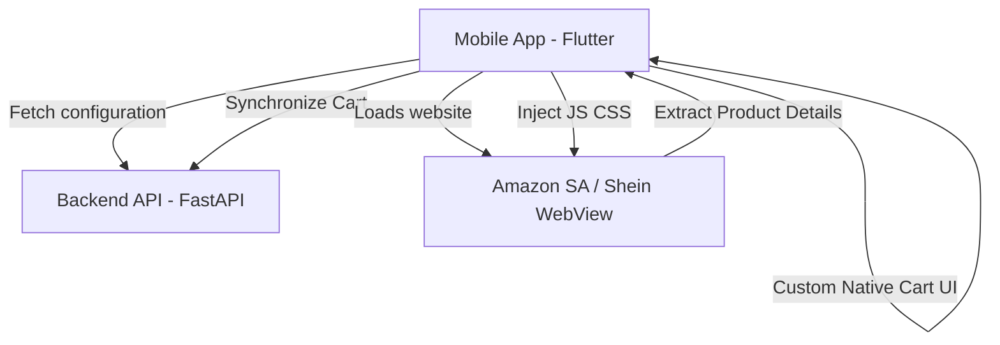

# MVP Commerce Project Plan: Backend & Mobile

This document outlines the architecture, configuration, and setup for the MVP Commerce Scraper & Modifier application.

## 1. System Architecture



The system comprises two core components:
1. **`backend/`**: A FastAPI application in Python that stores scraping configurations (CSS selectors for different domains) and handles the cart backend database.
2. **`mobile/`**: A Flutter application that loads e-commerce websites in a WebView (`flutter_inappwebview`), hides native buy buttons via CSS, extracts product details (Title, Price, Image) via JavaScript, and presents native custom buttons.

---

## 2. Directory Structure

- `backend/`: Python server.
- `mobile/`: Flutter mobile project.
- `plan.md`: This project blueprint and running instructions.

---

## 3. Running & Testing

### Backend
1. Initialize virtual environment:
   ```bash
   cd backend
   python -m venv .venv
   .venv/Scripts/activate
   pip install -r requirements.txt
   ```
2. Start the server:
   ```bash
   python run.py
   ```
3. Run tests:
   ```bash
   pytest
   ```

### Mobile
1. Get packages:
   ```bash
   cd mobile
   flutter pub get
   ```
2. Run on emulator or device:
   ```bash
   flutter run
   ```
